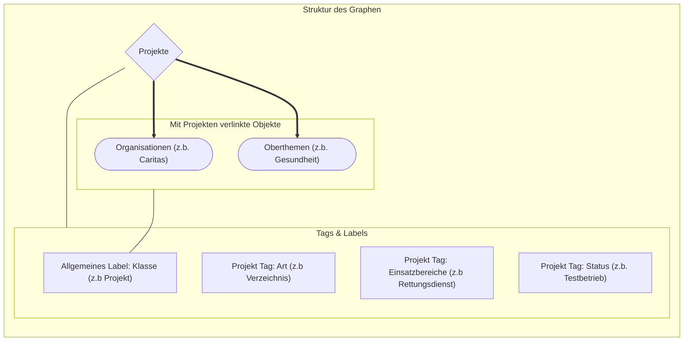

***
## Knoten
- Projekt
- Organisation 
- Thema (Zusammengefasste Einsatzbereiche) 
***
## Links
- Projekte -> Organisationen
- Projekte -> Themen
- Organisationen -> Themen 
***
## Tags / Labels 
- Klassen 
	- Projekt
	- Organisation
	- Thema
### Projekt Labels 
- Projekt: Art (Methodik)
	- KI Anwendung
	- Verzeichnis
	- Dokumentation
	- ...
- Projekt: Einsatzbereiche
	- Demokratie
	- Soziale Arbeit
	- Rettungsdienst 
	- ...
- Projekt: Status 
	- Online // Offline
	- Aktiv // Inaktiv
	- Planung/ Testbetrieb / Weiterentwicklung /Betrieb/ Abgeschlossen & Eingestellt
***