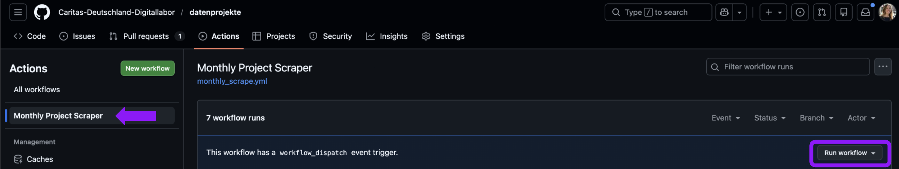

# 📊 Gemeinwohlorientierte Datenprojekte 🤝 - Civic Data Lab

Hier sammelt das Civic Data Lab gemeinwohlorientierte Datenprojekte aus unterschiedlichen Datenquellen zusammen.
Sie werden ausgespielt auf [datenprojekte.civic-data.de](https://datenprojekte.civic-data.de/).

Unsere Sammlung stellt eine durchsuchbare Übersicht über verschiedene Arten und Einsatzbereiche von gemeinwohlorientierten Datenprojekten zur Verfügung. Die Lizenz ist beim jeweiligen Projekt angegeben.


## 📊 Übersicht aller Datenquellen

Aktuell werden Daten zu gemeinwohlorientierten Projekten entweder einmalig gesammelt oder monatlich automatisiert ermittelt. Im Folgenden, werden die Datenquellen näher beschrieben.

### Einmalig gesammelte Datenquellen

Die folgenden Datenquellen wurden einmalig gesammelt, z.B. durch einmaliges Webscraping oder Hinterlegen der Daten:

1. [Public Interest AI](https://publicinterest.ai/) - [hier](project_code/Webscraping/PublicInterestAI) befindet sich der Code des Webscrapings und die einmalig gesammelten Daten.
2. [Civic Data Lab](https://civic-data.de/) - [hier](project_code/Webscraping/Erfolgsgeschichten) befinden sich die einmalig gesammelten Daten.
3. [Correlaid Projektdatenbank](https://correlaid.org/daten-nutzen/projektdatenbank/) - [hier](project_code/Webscraping/Correlaid-Projektdatenbank) befindet sich der Code des Webscrapings und die einmalig gesammelten Daten.

### Automatisiert gesammelte Datenquellen

Monatlich werden die folgenden Datenquellen automatisiert ermittelt bzw. aktualisiert:

1. [CityLAB Berlin](https://citylab-berlin.org/de/projects/) - [hier](project_code/Webscraping/Citylab_Berlin) befindet sich der Code des Webscrapings und die monatlich gesammelten Daten.
2. [Civic Coding](https://www.civic-coding.de/community-information/projekte) - [hier](project_code/Webscraping/Civic_Coding) befindet sich der Code des Webscrapings und die monatlich gesammelten Daten.
1. [Code For Germany](https://codefor.de/projekte/alle/) - [hier](project_code/Webscraping/CodeFor) befindet sich der Code des Webscrapings und die monatlich gesammelten Daten.

## 📂 Repository Struktur

Das folgende Schaubild gibt einen groben Übersblick auf die Struktur des Repositories.

```text
.
├── .github/workflows/        # GitHub Action Workflow
├── images/                   # Images used in documentation
├── project_code/             # Core logic and scripts
│   ├── monthly_pipeline.py   # Main entry point for the scraper
├── Vault/                    # Obsidian-Vault
├── .gitignore                # Ignore files  
├── README.md                 # Project documentation
└── requirements.txt          # Python dependencies
```

### Details zur Repository Struktur

1. `.github/workflows/`: Workflow, um die Datenprojekte monatlich zu aktualisieren, in dem das Skript `monthly_pipeline.py` via einer GitHub Action ausgeführt wird und mit Hilfe dessen die automatisiert gesammelten Daten ermittelt und die ganze Projektdatenbank aktualisiert wird.

2. Weitere Skripte & Daten in `project_code/`: Neben dem monatlich ausgeführtem Skript `monthly_pipeline.py` befinden sich weitere Skripte und Daten, um die Datenprojekte einmalig bwz. automatisiert zu ermitteln.

3. `Vault/`: Ordner mit allen Datenprojekten im Format von Obsidian-Vaults:
    - `Art`: Ordner mit den Arten der Projekte.
    - `Einsatzbereich`: Ordner mit den Einsatzbereichen der Projekte.
    - `Organisation`: Ordner mit den Organisationen der Projekte.
    - `Projekt`: Ordner mit den Projekten.

4. `.gitignore`: Ignoriert definierte Dateien und Ordner, die nicht in der Repository enthalten sein sollen.

5. `README.md`: Dokumentation des Projekts (diese Datei).

6. `requirements.txt`: Python Abhängigkeiten, um den Code des Projekts auszuführen.


## 👩‍💻 Code ausführen

### Manuelles Triggern der Scraping-Pipeline inkl. Vault-Aktualisierung
Falls benötigt, kann jederzeit der Workflow der Scraping-Pipeline und Vault-Aktualisierung manuell getriggert werden.

#### Ausführung via GitHub Website (Admin-Rechte erforderlich)
1. In der Repository-Seite auf die Schaltfläche "Actions" klicken.
2. Für den "Monthly Project Scraper", auf die Schaltfläche "Run workflow" klicken: 
3. Warten, bis der Workflow ausgeführt und ein Pull Request erstellt wurde.

### Lokale Code-Ausführung
1. Empfehlung: Zuerst ein neues, virtuelles Environment in Python erstellen, z.B. mit Hilfe von [conda](https://uoa-eresearch.github.io/eresearch-cookbook/recipe/2014/11/20/conda/) oder [venv](https://docs.python.org/3/library/venv.html). 
2. Danach die notwendigen Abhängigkeiten installieren: `pip install -r requirements.txt`.
Dund dort das Skript `monthly_pipeline.py` ausführen.
3. Optional: Falls das Skript `monthly_pipeline.py` oder ein Code-Snippet ausgeführt werden soll, welches Brave Search oder Groq LLMs benutzt, müssen lokal die Environment Variables `GROQ_API_KEY` und `BRAVE_API_KEY` gesetzt werden. Mehr Infos dazu [hier](https://www.twilio.com/en-us/blog/how-to-set-environment-variables-html).
3. Nun kann ein beliebiges Skript/Notebook ausgeführt werden, z.B. kann mit dem folgenden Command der monatliche Workflow lokal getriggert werden: 

    ```bash
    export PYTHONPATH=$PYTHONPATH:.
    python project_code/monthly_pipeline.py
    ```

## 🕸️ Obsidian lokal veranschaulichen

Um sich z.B. nach automatisierter Erstellung einer neuen Version des Obsidian Vaults veranschaulichen zu lassen, wie die neue Version der Datenprojekte-Website aussehen kann (nach dem Obsidian Publish), kann man sich den Ordner `Vault/` mit Hilfe von [Obsidian Desktop oder Obsidian Web](https://obsidian.md/download) lokal veranschaulichen. Durch Auswahl des Ordners `Vault/` dieses Repositories kann man sich die aktuelle Version der Datenprojekte-Website anschauen.


## 📚 Datendokumentation

Bei jeder monatlichen Ausführung des Workflows werden die Daten als CSV-Datei unter dem Pfad `data.csv` gespeichert. Das Notebook [`notebooks/exploration.ipynb`](notebooks/exploration.ipynb) zeigt beispielhaft, wie `data.csv` mit [Polars](https://pola.rs/) eingelesen und ausgewertet wird – inklusive Parsen der Listen-Spalten `art`/`einsatzbereich`, Zählen der häufigsten Kategorien und der Status-Verteilung.

### Felder

Die Tabelle listet die Spalten in der Reihenfolge, in der sie in `data.csv` stehen. Die Spalte „Mögliche Werte“ ist nur bei Feldern mit festem Wertebereich gefüllt.

| Feldname | Beschreibung | Mögliche Werte |
|---|---|---|
| `projektname` | Name des Datenprojekts | |
| `kurzzusammenfassung` | Kurzzusammenfassung des Datenprojekts | |
| `art` | Liste von Kategorien, denen das Projekt angehört (fester Satz, siehe [Fixe Kategorien](#fixe-kategorien)) | 22 Kategorien: Datenanalyse, Öffentliche Daten, Datenmanagement, Sprachtechnologie, Fortbildung, Künstliche Intelligenz, Bildverarbeitung, Karten & Verzeichnisse, Digitale Plattformen, Open-Source-Software, Webanwendungen, Automatisierung, Unterstützungstools, Datenerhebung, Wissensorganisation, Recommender System, Datenreporting, Wirkungsmessung, Interne Datenanwendung, Datenanwendung für Öffentlichkeit, Virtuelle Assistenz |
| `einsatzbereich` | Liste von Einsatzbereichen, denen das Projekt angehört (fester Satz, siehe [Fixe Kategorien](#fixe-kategorien)) | 16 Kategorien: Gesundheit, Internationale Projekte, Bildung, Klima & Umwelt, Inklusion & Teilhabe, Organisation & Professionalisierung, Soziale Dienste, Antidiskriminierung, Stadtentwicklung, Flucht & Migration, Demokratie & Soziale Rechte, Jugendhilfe, Sport, Arbeit & Soziales, Kultur |
| `status` | Status des Datenprojekts. Beim Veröffentlichen (`misc/publish_data.py`) auf einen festen Wertebereich normalisiert; uneinheitliche Rohangaben (Groß-/Kleinschreibung, `online - `-Präfix, `unclear`, `Laufend`) werden zusammengeführt, sonst `Unbekannt`. | `In Betrieb` (live/produktiv, inkl. `Laufend`), `In Planung` (geplant), `Im Testbetrieb` (Test-/Pilotphase), `Prototyp`, `In Weiterentwicklung` (online, aktiv weiterentwickelt), `Abgeschlossen`, `Eingestellt`, `Unbekannt` |
| `organisation` | Organisation(en), welche das Datenprojekt umsetzen/umgesetzt haben | |
| `webseite_link` | Website-Link des Datenprojekts | |
| `quelle` | Website-Link der Quelle des Datenprojekts | |
| `lizenz` | Lizenz der Quelle des Datenprojekts | |
| `lizenz_organisation` | Website-Link der Lizenz der Quelle des Datenprojekts | |

### Infos zu Status und Einsatzbereich

Die Kategorien für `art` und `einsatzbereich` sind festgesetzt und werden bei der monatlichen Ausführung nicht aktualisiert. Sie wurden einmalig per Clustering über Tags erstellt und können bei Bedarf manuell neu generiert werden in `project_code/MarkdownConverter/TermSimilarity/TermSimilarity.py`.

## ⚒️ Infrastruktur

Die folgende Liste gibt einen Überblick zum Tech Stack dieses Repositories und der [Datenprojekte-Website](https://datenprojekte.civic-data.de/):

- **GitHub:** Versionierung des Codes + gescrapter Daten (free tier)
- **GitHub Action**:** Dienst in GitHub, mit dem wiederkehrende Aufgaben rund um Softwareprojekte automatisch im Hintergrund ablaufen können, z.B. wird die monatliche Ausführung des Scrapings + Vault-Aktualisierung via einer GitHub Action ausgelöst (free tier, kostenlos für öffentliche GitHub Repos)
- **Brave Search API:** mit Hilfe der Brave Search API werden valide Website-Links für die im Datensatz enthaltenen Organisationen abgefragt (free tier)
- **Groq API:** Nutzung von LLMs, um u.a. die Art, den Einsatzbereich und die Abkürzung von Projekten zu erhalten (free tier)
- **Obsidian:** Die Datenprojekte-Website wird in Form eines Obsidian Vaults erstellt und via Obsidian Publish (paid tier) als statische Webseite gehostet unter https://datenprojekte.civic-data.de/.